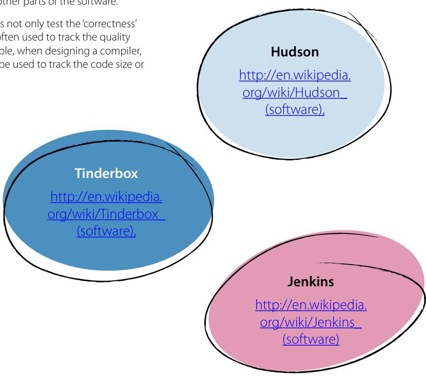

# ocr-guide-to-testing
---

## Page 1

# Skills Guide  

# THE OCR GUIDE TO TESTING  

Version 2

---

## Page 2

This guide on testing has been produced by OCR to help you understand the skills and techniques you will need to develop, practise and use in progressing your career. This guide has not been written to accompany a specific qualification but focuses on skills that relate to many areas of both education and work environments. Other skills guides are available at www.ocr.org.uk.  

## Contents  

What is testing? 3  Type of testing 4  Defining test criteria 5  Test scripts 6  Test plans and test strategies 7  Recording test results 8  Retesting 9  When should testing take place? 10  Who should undertake testing - in- house vs. external test houses? 11  Quality assurance methods 12  Ongoing testing 13  Conclusion 14  Useful links 15  Testing within Health & Social Care 16  

  

## We value your feedback  

We'd like to know your view on the resources we produce. By clicking on the icon above you will help us to ensure that our resources work for you.

---

## Page 3

## What is testing?  

## The purpose of testing is to make objective judgments about how well something meets, exceeds or fails to meet an identified set of criteria.  

You use testing when you want to understand and gain confidence that a product, system, process or device will perform well when it is eventually issued to customers and/or users.  

When you are involved in complex projects, such as software development or designing business systems, testing is important as it often identifies the end of the 'development' phase. It is also frequently used to establish the criteria on which a customer or end user will base their decision to either accept or refuse the project.  

## Definitions  

End User(s) - The person or persons that actually use a particular product or piece of software.  

Customer - A person or business that buys products or services. Customers can be end users however a business can purchase a product to include it, as a component, within one of its products to sell on to end users.  

## What are the purposes of testing?  

There are two basic purposes of testing:  

1. Testing checks that what has been produced and delivered is what was described in the specification agreed between the developer and the customer. It verifies that the system or product meets the performance, design, functional and implementation requirements identified within the specification.  
2. Testing also has the function of managing risk for both the customer and the supplier. In business, a testing program identifies whether a project has been completed to the satisfaction of both the customer and supplier so that the contract can be closed and paid for. It is at this point that the product or system moves into the 'maintenance' phase of the project life.  

## When should testing take place?  

If a generic product or software lifecycle is considered, testing commonly takes place between the 'development' phase and the product or application launch or handover (see the later section on when testing should take place for a more detailed explanation).  

---

## Page 4

## Types of testing  

There are three types of testing:  

1. Testing under normal conditions. This is where the software application, business system or physical artefact is tested under normal working conditions and, in the case of software development, data is provided that is within the expected range.  

2. Testing under extreme conditions. This is where the software application, business system or physical artefact is subjected to conditions within the operating range but at the limits of performance expectations.  

3. Testing error behaviour. This is where the software application, business system or physical artefact is subjected to conditions outside of the performance expectations. This is where a set of tests are performed that purposefully attempts to make things go wrong, to see if things happen when they shouldn't or things don't happen when they should.  

A typical example of these processes is the testing of databases. Under normal conditions a database is interrogated using data that it is well within its limits, so if the operating limits of a field is \(0 - 99\) , then 'normal' tests would expect to receive results that are well within that range. Under extreme conditions a database is interrogated using data at the limits of a fields range, so if we take our field with the limits of \(0 - 99\) , then 'extreme' tests would expect to receive results that are 0 or 99. Finally, error tests would be carried out on our field with the limits of \(0 - 99\) , where the known results should be a negative number or a number of 100 or greater to discover how the software behaves.  

Within software development and business systems, testing is done in conjunction with the processes of 'verification' and 'validation'. It is common to see these two terms used interchangeably within industry but this is incorrect as they have the following precise definitions:  

1. Verification is the evaluation of systems, products or items with regard to conformance and consistency against pre-determined requirements. In other words "Have we built the product right?" Verification is usually checked by carrying out functional testing, which refers to activities that verify a specific action or function of software code or product or system functionality against a desired response.  

2. Validation is the process of checking the product that has been built against the specification identified or agreed with the customer. In other words "Have we built the right product?" Validation is usually checked via non-functional testing that may not be related to a specific function or user action. Non-functional requirements tend to be those that reflect the quality of the product, particularly in the context of suitability from the perspective of the customer or end users. The non-functional testing of software describes the attributes of the system as a whole. In other words how well the complete system should carry out its purpose. Below are a selection of examples of non-functional software tests:  

- Load Test: The measurement of the system behaviour for increasing system loads. For example the number of users that work simultaneously or the number of transactions. An example of this could be the testing of a client/server website, for instance to investigate the number of hits per unit of time and what kind of performance is required under such loads (such as web server response time or database query response times).  

- Performance Test: The measuring of the processing speed and response time for particular use cases, usually dependent on increasing load. What kind of performance is expected on the client side of our website (e.g how fast should pages appear, how fast should animations, applets etc. load and run)?  

- Volume Test: The observation of the system behaviour dependent on the amount of the data (e.g processing of very large files).  

- Stress Test: The observation of the system behaviour when it is overloaded.  

- Security test: The testing of security against una

---

## Page 5

# Defining test criteria  

When creating a test plan, there is a range of different approaches that can be called upon for different testing situations however, in each scenario, specific criteria need to be defined and agreed between customer and supplier.  

## Pass/Fail Criteria  

When test engineers conduct tests on software code or a new business system, some aspects will pass and some will fail. The criteria for passing or failing need to be described in clear, unambiguous language and agreed with the customer. A procedure needs to be defined in advance of the tests to allow the engineers or test participants to log the problems they experience and other issues they believe need to be resolved.  

Pass/fail criteria are sometimes known as entry/exit or compliance criteria.  

Pass/fail test criteria is commonly used in the testing of Graphical User Interfaces (GUIs).  

## Acceptance Criteria  

Acceptance testing is a validation test that is conducted to determine if the requirements of a specific criteria or a whole contract has been met. The criteria by which acceptance testing is conducted need to be clearly defined and agreed between the customer and the supplier or developer. Additionally, the procedures by which the acceptance criteria are tested need to be defined and agreed, these may involve processes such as chemical tests, physical tests or performance tests.  

An example of a specific acceptance criterion within a software testing situation could be:  

A (named user role) can (select/operate) a (feature/ function) so that (output) is (visible/complete/etc.) This would lead to a yes/no decision for the user or developer.  

Within systems engineering, acceptance testing may involve 'black box testing' to be performed on a system, such as a piece of program code, a sub- assembly of manufactured components or chemical products prior to its delivery or commission. Black box testing is a functional test which is also known as application testing, confidence testing or quality assurance testing.  

## Alpha tests  

Alpha testing can either be simulated or actual operational testing by potential customers or by an outside independent testing company. This type of testing is often applied to off- the- shelf software or systems and is often used as a type of internal acceptance testing procedure, prior to the software being submitted for beta testing.  

## Beta tests  

Beta testing follows on from alpha testing and can be looked upon as a kind of external user acceptance testing. Software versions (known as beta versions) are released to a limited group of users outside of the development team. This further layer of testing ensures that when the new software is put on general release it has as few faults and bugs as possible.  

Beta versions are sometimes even released to selected members of the public who have an interest in using a new version but who are also willing to feedback to the organisation about issues and bugs they discover.  

An example of this could be the testing of a new version of an image- manipulation package. The alpha testing would be carried out at the software company's site until a level of performance is reached. Then, for a limited time the company will issue a release of the program to a select group of users for beta testing; this is the beta testing.  

Recently Adobe's Lightroom 4 has just come through a beta testing period and has now been released for sale. The beta testing versions no longer work on user tester's computers unless they buy a registration code and download an update.

---

## Page 6

## Test scripts  

## Test scripts are specifically applicable to software testing.  

A test script is a set of instructions that are performed on the code or system, which is being tested, to replicate user actions and investigate whether it performs as expected. A simple example of a test script to save a current file that has been saved before in a word processor could be:  

<table><tr><td>Step</td><td>Action</td><td>Result</td></tr><tr><td>1</td><td>Click on the file option of the main menu bar.</td><td>A drop down menu appears, one of the options is &#x27;Save&#x27;.</td></tr><tr><td>2</td><td>Click on the &#x27;Save&#x27; option from the drop down menu.</td><td>The disk whirs and the date/time stamp of the file in explorer matches the time that the file was saved.</td></tr></table>  

There are two methods of executing test scripts:  

1. Manual testing, within which test scripts are more commonly known as test cases, uses a set of conditions or variables under which a tester will determine whether a software system is operating correctly or not.  

2. Automated testing which can involve:  

A small piece of code written in a programming language which is used to test an area of functionality of a software system, Short, data- driven programs that contain extensive parameters. Keyword- driven or table- driven testing using reusable steps.  

The last two elements can also be used within manual testing.  

## The advantages of automated testing over manual testing using scripts  

Tests can be executed without the need for human intervention. Tests can be carried out much faster and are easily repeatable so are worth considering if a test is required to be executed several times.  

## The disadvantages of automated testing over manual testing using scripts  

Tests can be carried out much faster and are easily repeatable so are worth considering if a test is required to be executed several times.The disadvantages of automated testing over manual testing using scripts- Tests scripts can be poorly written and breakdown during use.- Ideally, it is helpful if a human tests the system at some point, as a trained manual tester can observe if the system being tested is misbehaving without being prompted or directed, whereas automated tests can only examine what they have been programmed to look at.- Manual testers can discover new bugs while ensuring that old bugs do not reappear, while an automated test can only ensure the latter.  

The ideal situation is to employ both manual and automatic types of testing with both using test scripts. This offers the best results by automating tests that are needed to be done frequently and that can be easily checked by a machine; and using manual testing to run new test scripts initially which can then be added to the automated test suite.

---

## Page 7

## Test plans and test strategies  

## There is a common misconception that test plans and test strategies are the same and therefore the terms are interchangeable. This is untrue as the two documents are very different and have different purposes.  

It is not uncommon for some companies to include a test strategy inside the test plan and this is acceptable for small projects. However, for larger projects there is usually one test strategy document and a number of different test plans aimed at each phase or level of testing.  

## Test strategies  

Test strategies are outlines that provide a description of a testing approach for a software or hardware development cycle. It is a high- level document whose purpose is to inform project managers, test engineers and developers of some of the key issues associated with the testing process. These could include the testing objectives, methodologies of testing new functionality, details of the total testing time and the resource requirements for the testing environment or site. A typical test strategy document of a software company could include:  

Scope and Objectives Business issues Roles and responsibilities Communication and status reporting Test deliverability Industry standards to follow Test automation and tools Testing measurements and metrics Risks and mitigation Defect reporting and tracking Change and configuration management Training plan.  

Here is an example of a software test strategy template https://www.softwaretestinghelp.com/ writing- test- strategy- document- template/  

Test strategies describe how risks for the company associated with a product or system are reduced by conducting the tests. The documentation also describes which kind of tests will be performed and what entry/ exit criteria will apply (if this applicable to the product or software).  

Test strategies are created based on development design documentation and for every stage of development design, a corresponding test strategy should be created to test the new and adapted features.  

## Test plans  

Test plans are documents that detail the systematic approach to each phase or level of testing of a product or piece of software. The test plan documentation is usually written by the test manager and focuses on describing what to test, how to test, when to test and who will conduct which test; it is a detailed description of the eventual test workflow, together with the planned outcomes and associated expectations.  

Large test projects occasionally have one master test plan that is a common document for all the test phases.  

Here is a link to comprehensive example of a sample software test plan http://pbsys.tripod.com/resources/ templates/Templates.html

---

## Page 8

## Recording test results  

As you can imagine there are many ways in which to record test results with a lot depending on the actual test being carried out.  

If an electrician needs to record the results of a compliance test of an electrical installation he can simply read the information displayed by the test equipment and record the results on a form manually which is then attached to a certification form.  

Often test analysis equipment used in industries such as engineering, chemical or mining industries, will record the test results electronically. The equipment can then be connected to computers and the results downloaded in the form of a .csv file and easily transformed into a spreadsheet.  

With regard to software testing, there are a wide variety of both open source and proprietary testing tools available for this purpose. These can be manually operated or automated. Obviously there are differences in the manner in which software testing tools work but they typically all follow a similar format. A defect tracking or debugging system within the programs uses facilities such as instruction set simulators, program animations or benchmarks to detect and record any errors or bugs it finds and documents what occurred, where within the code it occurred and a preliminary assessment of the severity of the error. The information is then transformed into measurements of different aspects of the software or its specification called 'metrics' (see below).  

In User Acceptance Testing of software, 'user stories' are written. These are one or more sentences that are written in the everyday or business- like language of the end user. A 'user story' captures the 'who', 'what' and 'why' of a requirement in a simple, concise way and is often limited in detail by what can be handwritten on a small paper notecard. They can be written by or for the business user as the primary way that they can influence the functionality of the system or application being developed. User stories may also be written by developers in order for them to convey non- functional requirements such as security features, performance or quality. Follow this link for examples of 'user stories' - http://en.wikipedia.org/wiki/User_ story#Examples.  

## What happens to the results?  

When software testing is completed, testers generate 'metrics', which are measurements of some property or aspect of a piece of software or its specifications. These could be bugs per line of code, program load time, number of lines of customer requirements or simply program size. These are then passed to the development team for them to decide what defects should be assigned, fixed, rejected or deferred to be dealt with later.  

An example of a test metrics document can be seen here: www.cyreath.co.uk/papers/Cyreath_Software_Test_Metrics.pdf  

With regard to the testing of the product, the most common procedure is for the test engineers who carry out the tests to gather the results and write a report summarising what errors or issues were discovered during the test. This is then passed to the development team who then decide the course of action to rectify the problems.  

---

## Page 9

## Retesting  

## When a development team are satisfied that rectification process has been completed they will submit the application or product for retesting.  

Retesting could entail the submission of the application or artefact to the full range of original tests or maybe just a selection of the tests that the item originally failed. However, the same stringent recording and reporting procedures are still applied to any retests.  

## Regression testing  

Part of the process of retesting software may include 'regression testing'. This is a type of functional testing that seeks to uncover new issues, called 'regressions', in existing functionality after alterations have been made to an application or system such as functional enhancements, patches or configuration changes.  

The purpose of regression testing is to ensure that a change, such as the fixing of a bug, did not introduce new errors. One reason for carrying out regression testing is to investigate whether a modification in one part of a program has affected other parts of the software.  

Regression testing does not only test the 'correctness' of the program but is often used to track the quality of its output. For example, when designing a compiler, regression testing can be used to track the code size or the simulation time.  

Regression testing can be automated and there are a number of software tools available for this purpose such as 'Tinderbox', 'Hudson' and 'Jenkins'.  

Typical regression testing methods include re- running previously executed run tests and checking whether the software behaviour has altered and whether previously corrected bugs have reoccurred.  

Regression testing is an efficient method of testing an application or system due to the ability of the tester to systematically choose the appropriate minimum number of tests required to satisfactorily cover a particular modification.  

---

## Page 10

## When should testing take place?  

## For a generic product or software lifecycle, testing takes place during and between the development phase and the product or application launch.  

During the latter stages of the development phase, the person responsible for quality assurance (this could be an individual or a department, depending on the size of the organisation) prepares test plans and may also configure a test environment.  

Testing often happens on an iterative (repeated) basis with each iteration checking off issues identified in the previous round of testing, together with looking at new content or product.  

This happens alongside other functional groups that might prepare documentation to support customers, trainers and suppliers. Only when the required completed documentation has been compiled and signed off will the handover to testing occur.  

The testing of business IT systems could involve readiness tests that take place within a laboratory environment or IT department where controlled system or network operational tests may be performed to ensure operational readiness. Additionally, field tests may occur with small target groups of users within the actual business environment.  

---

## Page 11

# Who should undertake testing - in-house vs. external test houses?  

There is an ongoing debate regarding which is more advantageous, using in- house or external testing.  

In- house testing is when an organisation employs its own test engineers or programmers to test the products, systems or programs that it developers itself.  

External testing companies are companies whose main business focus is testing. These companies usually specialise in the testing for particular industries or products, for example aerospace, marine equipment, nuclear technology or software applications for different purposes.  

Below is a list of points that highlight the advantages of each of the approaches.  

The links below are to the websites of a number of typical external software testing companies:  

BugHuntress - www.bughuntress.com Elinext - www.elinext.com/softwaretesting Testing Circle - https://testingcircle.com/  

## The advantages of using in-house testing  

Although for a number of years it has become usual for companies to outsource testing recently, and as a result of companies wishing to cut costs, in- house testing has begun to become attractive once more. The advantages to in- house testing are:  

1. It is significantly cheaper than outsourcing testing to external testing organisations.  

2. Companies can employ people with skills additional to their testing expertise so that when they are not engaged in testing they can be utilised within other departments.  

3. In-house test engineers understand the product and there are no issues with regard to mis-communicating the details of complex products or systems, which can potentially put projects at risk.  

4. If the system is being developed for use within the business then in-house engineers will have a better knowledge and understanding of how people work within the organisation and will be aware of any potential issues within specific departments. They will also be able to organise targeted field testing more efficiently as a consequence of knowing which management personnel to approach.  

## The advantages of using external test houses  

There are a number of benefits to outsourcing product and software testing to external testing organisations. These are detailed below:  

1. The company can gain confidence in the knowledge that their product is being tested by certified, trained and experienced test engineers.  
2. Test companies usually have a great deal of expertise in automated testing which allows the repeated tests to be done quickly, accurately and efficiently.  
3. There is a minimum amount of time spent on specific knowledge transfer as the engineers derive their product understanding from the requirement documentation provided by the customer.  
4. As a consequence of their expertise in test data management the test data that is critical to replicating real-time scenarios becomes easily accessible.  
5. Testing companies apply robust, objective and procedural engineering approaches to software testing which offer confidence and efficiency.  
6. Testing houses usually have flexibility with regard to team size and so can increase or decrease numbers in accordance to customer requirements.  

7. Professional testing companies commonly have access to cutting-edge equipment and software.  

7. Professional testing companies commonly have access to cutting-edge equipment and software.  

---

## Page 12

# Quality assurance methods  

## Quality assurance (QA) methods are defined as scheduled and systematic events implemented within a quality system to ensure that quality requirements for a product, application, system or service will be fulfilled.  

QA systems incorporate methods of consistent measurement, procedures to compare the resulting measurements with a standard, monitoring of processes and the inclusion of associated feedback loops, which prevents errors.  

Quality assurance should not be confused with quality control where the emphasis is on process outputs.  

The essence of quality assurance is basically two principles:  

'Fit for Purpose', which refers to the fact that the product, system or software should be suitable for its intended purpose and; 'Right First Time' which refers to the implementation of procedures with the sole purpose of eradicating mistakes.  

QA covers a wide range of aspects associated with the production of products, systems or applications including the management of the quality of raw materials, assemblies of components, production methods and services, management procedures and production and inspection processes.  

It should be understood that acceptable quality is decided upon by users or customers and not society in general. It is a common misconception that quality is linked to price or descriptions such as 'high' or 'low' quality.  

This is in fact untrue, for example a low- priced product may be regarded as having 'high' quality as a consequence of being biodegradable (for example these bowls https://www.biopak.com/uk/products/plates- bowls- trays/palm- leaf- tableware, whereas another could be considered as having 'low' quality because it too is biodegradable, such as the paper used to print most newspapers.  

paper used to print most newspapers.  

Quality assurance processes can take many forms and vary in scope and complexity. It is very common for standard QA processes to be modified to suit a specific production process. A typical quality assurance process may include:  

- the testing of previous products or systems- the creation of a plan to improve- the production of a design that includes improvements and requirements- the manufacturing with improvements- an evaluation of the new product or system with the improvements- the testing of the new product or system.  

---

## Page 13

## Ongoing testing  

Many software houses now use a post- release facility where, in the event of users encountering a bug or experience a crash, a window appears which invites the user to complete a bug report.  

## User feedback  

This is then sent to the company along with a file identifying which area of the program crashed and details of the crash. From this feedback the software house can understand whether there is a persistent problem and helps them to decide whether to issue a patch or an update.  

This is a link to an example of a user feedback form - http://webscripts.softpedia.com/screenshots/ Feedback- and- Complaint- Form- 26491. png  

## User experience programs  

A lot of software companies are now inviting new customers to be participants in a user experience program in exchange for gifts or free upgrades. When a user installs the new application it will ask them to register their purchase with the software company. Within this registration process, there will be an invitation to participate in the program and if the user agrees the company will periodically request feedback about their experience when using the program. Some companies even include a function within their programme's facilities where, with the user's permission, they can capture performance data direct from the software over the internet.  

## Ongoing reliability tests  

Ongoing reliability tests are hardware tests commonly associated with manufacturing to ensure that the quality of the products that are coming off the production line after a period of time after release are still of the same specifications as the early models manufactured soon after release.  

Products are sometimes placed in a 'burn- in' chamber that matches the upper limits of the specification temperature in order to bring the product to early maturity. The quality of the product is then measured and if the unit fails then an investigation proceeds to find out if parts bought from other manufacturers are the items that caused the failure. If this isn't the case then the whole batch of units that were produced at the same time as the failed unit are tagged for retesting or repair to either verify or correct the issue.  

This website explains the differences between software and hardware reliability testing including some useful graphs - www.ece.cmu.edu/\\~koopman/ des_s99/sw_reliability/  

---

## Page 14

## Conclusion  

## In summary the important points to remember about testing are:  

Testing is an important and crucial part of a product or software lifecycle that is purposefully scheduled within a defined place between the development stage and the product or application launch.- It is the stage in the process that verifies that a product or application meets performance, design, functional and implementation requirements identified within a specification that has been agreed between a supplier and a customer or end user.- Testing provides the confidence that a project has been completed to the satisfaction of both the customer and supplier so that the contract can be closed and paid for.- Testing is a formal QA process that can be carried out by expert, outside companies or in- house specialist departments. It consists of specific procedures described within test strategies and test plans that inform test engineers whether a product or a piece of software meets specific test criteria.  

It is important to incorporate both manual and automated procedures into test strategies in order to have the confidence that comprehensive testing has taken place.- There are a range of test criteria that exist for specific purposes including pass/fail criteria and acceptance criteria that involves alpha and beta testing procedures.- The results of testing inform the decisions that development personnel have to make regarding the production and the state of readiness of a product.- The process of recording and the presentation format of the test results is an important consideration for test engineers.  

## Useful links  

Software Testing: www.ece.cmu.edu/\~koopman/des s99/sw testing/  

An IBM web page with numerous links associated with writing a manual test script: http://publish.boulder.ibm.com/infocenter/rtnlhelp/v6r0m0/index.jsp?topic=%2Fcom.ibm.rational.test. mt.doc%2Ftopics%2Ft_writingamt.html  

A Microsoft web page about designing test cases: http://technet.microsoft.com/en- us/library/cc782852(v=ws.10).aspx  

An Agile Modelling web page about user stories: www.agilemodeling.com/artifacts/userStory.htm  

An informative web page regarding regression testing: http://smartbear.com/products/qa- tools/automated- testing/supported- testing- types/regression- testing/

---

## Page 15

## Testing within Health & Social Care  

At first glance it would appear that testing within IT, business and industry would have little in common with testing procedures that are carried out within the Health & Social Care context and it is true that there are major differences however, look a little closer and there are similarities also.  

Whereas the purposes of testing within IT, business and industry are associated with products meeting specification criteria and minimising risk for product stakeholders, the purpose of testing within Health & Social Care is to measure various attributes of the body's systems to determine the overall health of the individual.  

The typical, non- invasive tests that a health and social care professional may carry out include the measurement of pulse rate, breathing rate, temperature and blood pressure. The resulting readings are then compared with expected standard values that have been confirmed and agreed by medical science. In a lot of respects this is similar to the manner in which industry compares captured test values to specification requirements agreed with between vendor and client.  

Additionally, just like a test engineer having knowledge of how adverse or extreme conditions can impact on product test values, so must the health professional have awareness of how certain physical and medical factors can affect the reliability of body system measurements.  

During performance tests, software or a product may be subjected to different conditions such as increasing the data rate, the speed of operation or the operating temperature. Similarly, the health professional must be aware of the differing behaviour of attributes such as pulse rate, breathing rate and blood pressure etc. during and recovering from exercise.  

There are also similarities between the professions in the manner in which captured test data maybe collated and presented by using csv. files, spreadsheets, graphs, tables and charts. Also, just like a test engineer might do a health professional maybe called upon to use gathered data to write a report to be submitted to a management team.  

---

## Page 16

## OCR Resources: the small print  

OCR's resources are provided to support the delivery of OCR qualifications, but in no way constitute an endorsed teaching method that is required by OCR. Whilst every effort is made to ensure the accuracy of the content, OCR cannot be held responsible for any errors or omissions within these resources. We update our resources on a regular basis, so please check the OCR website to ensure you have the most up to date version.  

This resource may be freely copied and distributed, as long as the OCR logo and this small print remain intact and OCR is acknowledged as the originator of this work.  

Our documents are updated over time. Whilst every effort is made to check all documents, there may be contradictions between published support and the specification, therefore please use the information on the latest specification at all times. Where changes are made to specifications these will be indicated within the document, there will be a new version number indicated, and a summary of the changes. If you do notice a discrepancy between the specification and a resource please contact us at: resources.feedback@ocr.org.uk.  

OCR acknowledges the use of the following content: Page 3: Food testing, Alex Traksel, www.shutterstock.com, Page 8: Computer engineer, Nomad, www.shutterstock.com, Page 10: woman in lab, Darren Baker, www.shutterstock.com, Page 11: Man working on computer, Rawpixel.com, www.shutterstock.com, Page 12: Technical building, Godlux, www.shutterstock.com Whether you already offer OCR qualifications, are new to OCR, or are considering switching from your current provider/awarding organisation, you can request more information by completing the Expression of Interest form which can be found here: www.ocr.org.uk/expression- of- interest  

Please get in touch if you want to discuss the accessibility of resources we offer to support delivery of our qualifications: resources.feedback@ocr.org.uk  

## Looking for a resource?  

There is now a quick and easy search tool to help find free resources for your qualification: www.ocr.org.uk/i- want- to/find- resources/  

## Need to get in touch?  

If you ever have any questions about OCR qualifications or services (including administration, logistics and teaching) please feel free to get in touch with our Customer Support Centre.  

Vocational qualifications Telephone 02476 851509 Facsimile 02476 851633 Email vocational.qualifications@ocr.org.uk  

www.ocr.org.uk  

www.ocr.org.uk  

www.ocr.org.uk  

www.ocr.org.uk  

www.ocr.org.uk  

www.ocr.org.uk  

www.ocr.org.uk  

www.ocr.org.uk  

www.ocr.org.uk  

www.ocr.org.uk  

www.ocr.org.uk  

www.ocr.org.uk  

www.ocr.org.uk  

<|ref|>text<|/ref|><|det|>
